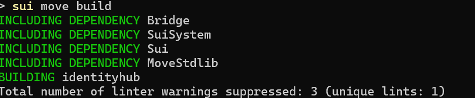
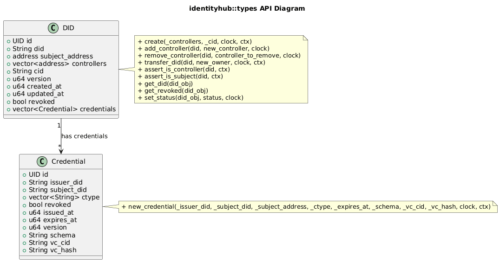
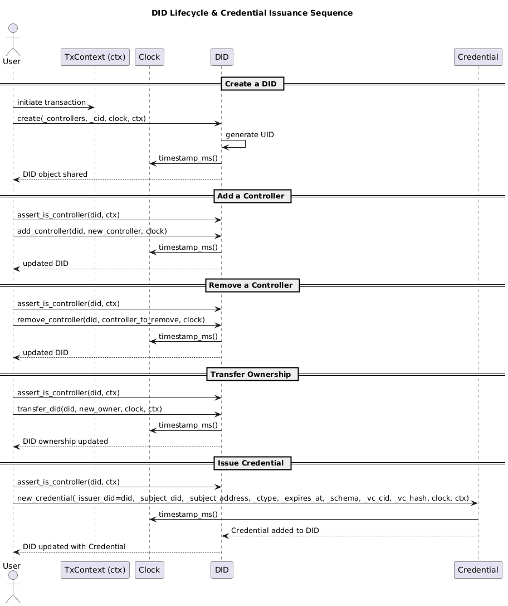

# 🌊 Sui Identity Hub
The Missing Digital Identity Layer for Web3

Sui Identity Hub is building the missing digital identity piece for the Sui platform.

To date, Sui only works with accounts. Not even Sui Name Service, which boasts the slogan "own your identity", is technically anything more than an account alias no true identity. This is exactly the problem that we are solving by bringing Decentralized Identifiers (DIDs) natively to Sui, being fully W3C DID standard compliant.

With  `did:sui`, individuals now have a native on-chain identity that is interoperable between services. 

`Credentials` can be issued, stored, and verified natively on-chain, but with off-chain representations for enhanced interoperability.

This approach unlocks several key features:

Authentic identity ownership: 

- Users' DIDs are  `decoupled` from accounts, so identity can be recovered even if a wallet is lost due to DID controllers.
  Credential binding: Verifiable Credentials (VCs) are directly bound to DID objects, enabling KYC, access control, and other trust models.
- `Service interoperability`: Institutions are now able to deploy compliant on-chain services without needing users themselves to handle compliance. Institutions can issue and authenticate credentials against the DID method.
- `Asset recovery`: Assets (ex:in a vault) can be linked to a DID rather than a single account. Even if the initial account is lost, the DID owner can recover from another wallet.

In short, Sui Identity Hub bridges the gap between Sui accounts and actual identities. It is the foundation for compliant, interoperable, and user-owned digital identity making it possible for both individuals and institutions to build real-world use cases on-chain.

## Command

```bash
sui move build
```



## Schema


### UML




### Sequence diagram



## Move programs

### Module: `identityhub::types`

This module defines Decentralized Identifiers (DIDs) and Verifiable Credentials (VCs) on Sui, with functions to create, manage, and control them.

#### Constants

| Name                 | Type  | Description                                              |
| -------------------- | ----- | -------------------------------------------------------- |
| `EDIDError`          | `u64` | Generic DID error code.                                  |
| `EDIDRevoked`        | `u64` | Error code for operations on a revoked DID.              |
| `EDIDAlreadyRevoked` | `u64` | Error code when trying to revoke an already revoked DID. |
| `EDIDAlreadyActive`  | `u64` | Error code when trying to reactivate an active DID.      |
| `EDIDNoController`   | `u64` | Error code when no controller is found for an operation. |
| `EDIDNoAController`  | `u64` | Error code when sender is not a controller.              |

------

#### Structs

##### `DID`

Represents a Decentralized Identifier.

| Field             | Type                 | Description                             |
| ----------------- | -------------------- | --------------------------------------- |
| `id`              | `UID`                | Unique object identifier.               |
| `did`             | `String`             | The DID string (`did:sui:<address>`).   |
| `subject_address` | `address`            | The owner of the DID.                   |
| `controllers`     | `vector<address>`    | Addresses authorized to manage the DID. |
| `cid`             | `String`             | Metadata/content identifier.            |
| `version`         | `u64`                | Version number of the DID.              |
| `created_at`      | `u64`                | Timestamp of creation (ms).             |
| `updated_at`      | `u64`                | Timestamp of last update (ms).          |
| `revoked`         | `bool`               | Status flag: `true` if revoked.         |
| `credentials`     | `vector<Credential>` | Linked verifiable credentials.          |

##### `Credential`

Represents a Verifiable Credential issued to a DID.

| Field         | Type             | Description                           |
| ------------- | ---------------- | ------------------------------------- |
| `id`          | `UID`            | Unique object identifier.             |
| `issuer_did`  | `String`         | DID of the issuer.                    |
| `subject_did` | `String`         | DID of the subject.                   |
| `ctype`       | `vector<String>` | Credential types.                     |
| `revoked`     | `bool`           | Revocation status.                    |
| `issued_at`   | `u64`            | Timestamp of issuance (ms).           |
| `expires_at`  | `u64`            | Expiration timestamp (ms).            |
| `version`     | `u64`            | Version number.                       |
| `schema`      | `String`         | Credential schema.                    |
| `vc_cid`      | `String`         | Content identifier of the credential. |
| `vc_hash`     | `String`         | Hash of the credential content.       |

------

#### Functions

##### DID Management

###### `create`

```
public fun create(_controllers: vector<address>, _cid: String, clock: &Clock, ctx: &mut TxContext)
```

- Creates a new DID object.
- Parameters:
  - `_controllers`: List of addresses that can manage this DID (must have ≥1).
  - `_cid`: Metadata/content identifier.
  - `clock`: Reference to the system clock.
  - `ctx`: Transaction context.
- Returns: Shared DID object.

##### `add_controller`

```
public fun add_controller(did: &mut DID, new_controller: address, clock: &Clock)
```

- Adds a new controller to an existing DID.
- Parameters:
  - `did`: Mutable reference to DID.
  - `new_controller`: Address to add.
  - `clock`: Reference to system clock.

###### `remove_controller`

```
public fun remove_controller(did: &mut DID, controller_to_remove: address, clock: &Clock)
```

- Removes a controller from a DID.
- Parameters:
  - `did`: Mutable reference to DID.
  - `controller_to_remove`: Address to remove.
  - `clock`: Reference to system clock.

###### `transfer_did`

```
public fun transfer_did(did: &mut DID, new_owner: address, clock: &Clock, ctx: &TxContext)
```

- Transfers ownership of a DID to another address.
- Parameters:
  - `did`: Mutable reference to DID.
  - `new_owner`: Address of new owner.
  - `clock`: System clock reference.
  - `ctx`: Transaction context (used to assert controller).

###### `assert_is_controller`

```
public fun assert_is_controller(did: &DID, ctx: &TxContext)
```

- Ensures the caller is a controller.
- Parameters:
  - `did`: Reference to DID.
  - `ctx`: Transaction context.

###### `assert_is_subject`

```
public fun assert_is_subject(did: &DID, ctx: &TxContext)
```

- Ensures the caller is the subject (owner) of the DID.
- Parameters:
  - `did`: Reference to DID.
  - `ctx`: Transaction context.

###### `get_did`

```
public fun get_did(did_obj: &DID): String
```

- Returns the DID string.

###### `get_revoked`

```
public fun get_revoked(did_obj: &DID): bool
```

- Returns whether the DID is revoked.

###### `set_status`

```
public fun set_status(did_obj: &mut DID, status: bool, clock: &Clock)
```

- Sets revocation status for a DID.
- Parameters:
  - `did_obj`: Mutable reference to DID.
  - `status`: `true` to revoke, `false` to reactivate.
  - `clock`: System clock reference.

------

#### Credential Management

##### `new_credential`

```
public fun new_credential(
    _issuer_did: &DID,
    _subject_did: String,
    _subject_address: address,
    _ctype: vector<String>,
    _expires_at: u64,
    _schema: String,
    _vc_cid: String,
    _vc_hash: String,
    clock: &Clock,
    ctx: &mut TxContext
) : Credential
```

- Creates a new verifiable credential linked to a DID.
- Parameters:
  - `_issuer_did`: Reference to issuing DID.
  - `_subject_did`: DID of the subject.
  - `_subject_address`: Address of the subject.
  - `_ctype`: Credential types.
  - `_expires_at`: Expiration timestamp (ms).
  - `_schema`: Schema string.
  - `_vc_cid`: Credential content identifier.
  - `_vc_hash`: Credential hash.
  - `clock`: System clock reference.
  - `ctx`: Transaction context.
- Returns: Newly created `Credential` object.
